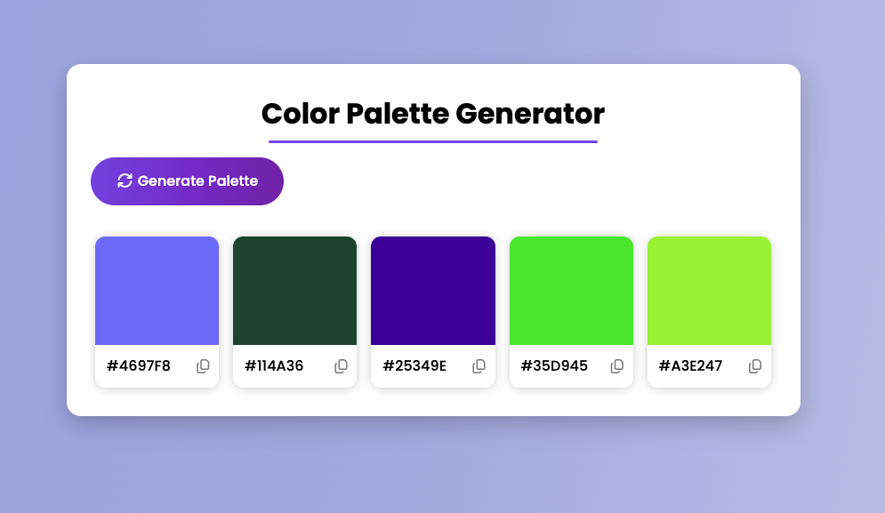

# Color Palette Generator

A simple web app to generate random color palettes and copy color hex codes to your clipboard.

## Features

- Generate a palette of 5 random colors.
- Click a color or the copy icon to copy its hex code.
- Responsive and modern UI.

## Usage

1. Open `index.html` in your browser.
2. Click the **Generate Palette** button to create a new color palette.
3. Click on any color box or the copy icon to copy the color's hex code.

## Project Structure

- `index.html` – Main HTML file.
- `style.css` – Styles for the app.
- `app.js` – JavaScript logic for generating colors and handling user interactions.

## Screenshots

 <!-- Add a screenshot if available -->

## Credits

UI design inspired by a YouTube tutorial.

